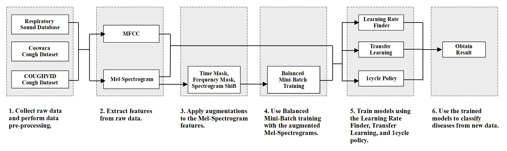

# research_classification-of-respiratory-diseases-and-covid19

A research on respiratory diseases and COVID-19 classification from respiratory and cough sounds using deep learning.

## Requirements  

### Datasets:  
[Coswara Dataset](https://github.com/iiscleap/Coswara-Data)  
[COUGHVID Dataset](https://zenodo.org/record/7024894)  
[ICBHI Respiratory Sound Database](https://bhichallenge.med.auth.gr/ICBHI_2017_Challenge)  

### Deep Learning Libraries:  
[fastai - v2.5.2](https://github.com/fastai/fastai)  
[Fastaudio](https://github.com/fastaudio/fastaudio)  
[scikit-learn](https://github.com/scikit-learn/scikit-learn)  
[seaborn - v1.0.2](https://github.com/mwaskom/seaborn)  
[Matplotlib - v3.2.2](https://github.com/matplotlib/matplotlib)  

## Experiment Overflow  

## Code Execution Steps  
- Install and import required libraries.
- Load data from the datasets.
- Separate the disease specific data.
- Save audio files' location and the corresponding labels in dataframe.
- Extract audio features.
  - Resize audio to a uniform length.
  - Generate MFCC and Mel-Spectrogram separately.
  - Apply feature augmentation to Mel-Spectrogram separately.
- Split data into different sets.
- Load audio files into a batch dataloader.
  - Calculate and add weights to each training sample.
  - Create balanced mini-batch dataloader using the weights.
- Load pre-trained CNN models.
  - Change input shape to 1 channel.
- Train the CNN models.
  - Find an optimum learning rate.
  - Train using finetune and 1cycle training separately.
- Evaluate the models using test sets.

